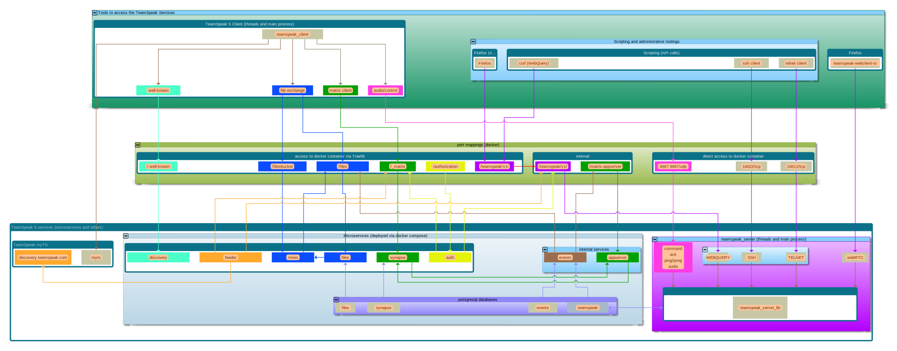
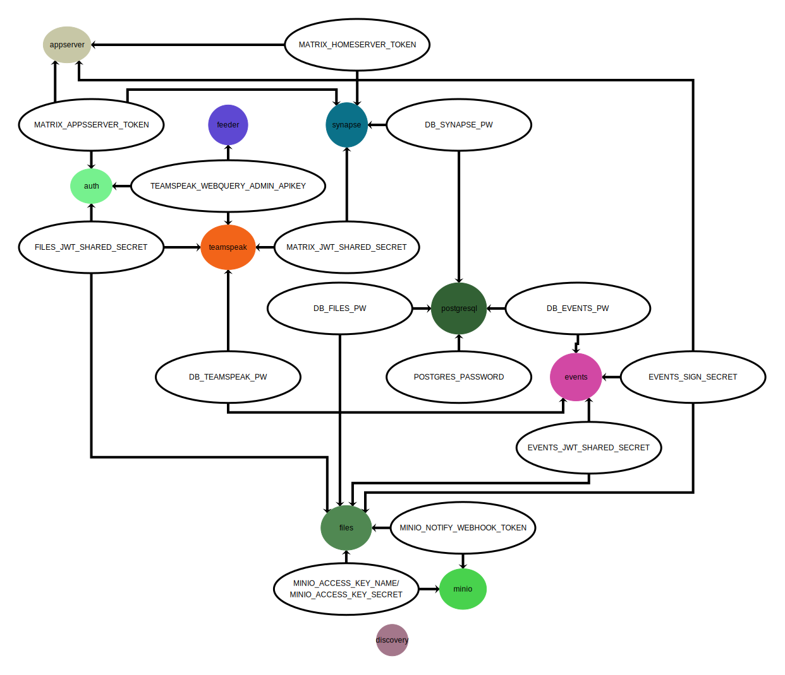

# TeamSpeak 5 services overview

TeamSpeak 5 Server is a collection of services:



Note: Please see [teamspeak-services-diagram/README.md](teamspeak-services-diagram/README.md) how to update this diagram!

* **docker/compose**: Used to distribute and manage the services
* **traefik**: Used as a reverse-proxy to connect ts5clients to internal services but also serves an internal network
* **discovery**: informs the outside world of the location of services.
* **teamspeak**: handles all the voice traffic, manages the chat and file transfer.
* **synapse**: handles all the text chat traffic.
* **files**: handles all files and images for chat and file browser.
* **minio**: backend for handling the files storage.
* **auth**: handles access to services.
* **events**: Helper service to bridge the teamspeak service to the appserver/files service.
* **appserver**: Helper service to bridge synapse (matrix) to our other services
* **feeder**: keeps the central teamspeak server list up-to-date about the local teamspeak server voice servers and chats.
* **postgresql**: central database which is used by the microservices

All these services run in one or more domains. To run a TeamSpeak Server that can chat with users on other servers, a unique domain name is required, and it is required that http traffic to it is secured with TLS (https).

In this section the services listed in the overview will be discussed in more detail.

# services in the docker compose reference implementation

Starting with TeamSpeak 5, TeamSpeak will distribute its services in the form of docker images on **Docker Hub**. To show how these services can be configured to work together, and to provide home users with an easy way to setup a teamspeak server, TeamSpeak will distribute an archive which contains a docker-compose reference implementation. With a few simple commands all the services can be setup. The requirements for this to work is that docker is setup and running. This might be difficult for the non-technical enthusiast.

The archive provided by TeamSpeak contains a **docker-compose.yaml** file which is used by docker-compose to setup and run all the services. Additionally it contains some extra configuration files.

The image below attempts to convey the services that are running in the docker-comopse stack and how they are connected.

## traefik

For HTTPS all network traffic is passed to [Traefik](https://traefik.io/traefik/). This service is a reverse HTTP proxy. It first decrypts the HTTPS traffic to HTTP. It will then look at the URL that is requested and then send the request to the proper service unencrypted.

As mentioned, Traefik handles HTTPS traffic. By default, Traefik is configured to use [Let's Encrypt](https://letsencrypt.org/) to obtain and use an SSL certificate for your domain. This default should ensure that the administrator does not need to do any additional steps to setup encryption besides running our setup utility which is discussed later.

### interactions

* TeamSpeak WebQuery
* Synapse
* Filetransfer
* MinIO (actual file upload/download)
* Auth
* Feeder
* Discovery

For details see the docker-compose.yaml file.

## discovery

Discovery is used accessed by TeamSpeak Client(s) to find the right location for the services of this TeamSpeak Server. This is done using the `/.well-known/` namespace of your domain. This namespace is further subdivided into **matrix** and **teamspeak**.

The Matrix namespace handles discovery for Matrix chat. More information on that can be found in the Matrix [client](https://matrix.org/docs/spec/client_server/latest#well-known-uri) and [server](https://matrix.org/docs/spec/server_server/latest#resolving-server-names) documentation.

The teamspeak namespace handles discovery for the TeamSpeak Client. When the client wants to know for example the location of the media server it will check `teamspeak/UUID-of-the-server`. A concrete example is:

`https://example.com/.well-known/teamspeak/09ac35cc-e69f-5112-ba73-7e3d5d027050`

The response is a JSON object with the locations of the known TeamSpeak services. An example is:

``` JSON
{
  "teamspeak.server": {
    "base_url": "https://example.com/teamspeak"
  },
  "teamspeak.serverUUID": {
    "34203423-234v2342k-23v4234k-233452": "https://example.com/teamspeak1"
    "234-456n4567-ghjmgasdfasdfasd-45n7": "https://example.com/teamspeak2"
  },
  "chat" : {
    "domain": "https://example.com"
  },
  "files" : {
    "base_url": "https://example.com/files"
  },
  "authorization" : {
    "base_url": "https://example.com/authorization"
  },
  "invites" : {
    "base_url": "https://example.com/invites"
  }
}
```

The teamspeak.serverUUID will come shortly and is an idea only at this time.

The domain where this TeamSpeak `.well-known` information is hosted, is stored in the virtual server property `virtualserver_administrative_domain`. After a TeamSpeak Client has connected to a server it will read this virtual server property so it can locate the associated services.

Server administrators have to set this property or else the client can not function properly. This can currently only be done by setting the TeamSpeak Server commandline parameter `administrative_domain` to the right domain. Alternatively, this can be set with the same parameter name in a yaml config file.

This service does not interact with any other service, besides Traefik.

[nginx](https://www.nginx.com) is a webserver component to provide discovery.

## teamspeak

The teamspeak_server has several roles:
* voice chat
* text chat (kickoff)
* roles/resource management

In the docker compose context you can have one (default) or several teamspeak server records and then they will be executed from docker.
However, you could also remove the teamspeak record from the docker-compose.yaml file and use one or several ts-native instances but the setup will be complex and updates will require to update both the ts-native service(s) and the microservice at the same time which will be a daunting task.

### discovery

A TeamSpeak Server can be found by several methods by a client:
* a server name to connect to or
* a raw ip and port.

This concepts need to be discussed internally still:

 1. A [TeamSpeak Server nickname](https://forum.teamspeak.com/threads/132595-How-to-register-a-Server-Nickname)
 2. A [SRV DNS entry](https://support.teamspeak.com/hc/en-us/articles/360002711418-Does-TeamSpeak-3-support-DNS-SRV-records-)
 3. TSDNS which is depricated
 4. Regular DNS name

Once a client has connected to the TeamSpeak Server it reads the `virtualserver_administrative_domain` variable which holds the domain name to search for the `.well-known` URLs. It also reads the `virtualserver_uuid` variable which holds the identifier for the virtual server. This way the client can now query `https://“*value of virtualserver_administrative_domain*”/.well-known/teamspeak/“*value of virtualserver_uuid*”` which returns the teamspeak well-known document described in discovery

### teamspeak voice chat

The voice part works the same as TeamSpeak 3.

By default only UDP port **9987** is forwarded from the outside to the TeamSpeak Server inside docker.

### teamspeak text chat

In TeamSpeak 5 all text chats go over the Matrix protocol implemented with [Synapse](https://matrix.org/docs/projects/server/synapse).

A TeamSpeak Client connected to a TeamSpeak Server can request a chat login token. The server will return a JWT which the client can then use to login to Matrix.

A TeamSpeak 3 Client does not support the Matrix protocol and therefore cannot use the text chat.

The TeamSpeak server uses a dynamically generated `config.yaml` which includes a section like this:

``` yaml
chat:
  token duration seconds: 60
  jwt shared secret: NgeC1q8Qd7aF0kaXd3O5vBoN7vfiOKYh
```

The `token duration seconds` parameter specifies how long the login token is valid for. The `jwt shared secret` parameter is the shared secret that also has to be configures in the Matrix server.

Every client that connects to a TeamSpeak Server will login to Matrix using this method, in order for it to participate in channel chats. Clients can also request a TeamSpeak Server to be its **Homebase**. When set, the client will also use the Matrix server for other (non-channel) chats, like public group chats.

The first time the client asks the TeamSpeak Server for a login token to the Matrix chat. It can also ask for a login token when it has lost the access token for Matrix, or when it somehow expired.

Using chat.domain JSON entry in the TeamSpeak `.well-known` document retrieved when connecting to the TeamSpeak server, the client can now retrieve the Matrix client `.well-kown` URL and connect to that service using either the login token, or an existing access token.

### interactions

* PostrgreSQL for database.
* The TeamSpeak Client connects to the TeamSpeak Server over a UDP port
* A RAW and SSH query tcp port
* The HTTP query port is open to the internet. The prefix to contact it should be /teamspeak/v1 so the URL looks like this: https://domain/teamspeak/v1
* A teamspeak service requires the `events` service to access the same PostrgreSQL database.
* TeamSpeak is configured with shared secrets so it can create access tokens for chat (Synapse) and file (Filetransfer) which the TeamSpeak Client can use.
* Virtual TeamSpeak voice servers can be configured with "file tranfer classes" which specify the file size limits and quota for clients.

## synapse

[Synapse](https://matrix.org/docs/projects/server/synapse) service takes care of text chat.

### interactions

* TeamSpeak creates jwt login tokens that clients use to log into Synapse
* Synapse loads a module with custom rules from TeamSpeak at startup
* Synapse sends events concerting TeamSpeak users and rooms to the Matrix-Appserver
* The Matrix-Appserver can send commands to Synaps en reaction to Synapse and TeamSpeak events
* Synapse uses PostgreSQL for its data storage
* Auth servers from this or remote servers can query Synapse for Authentication (OpenID)
* Central Search Feeder queries Synapse for public rooms

## files

The client will upload and download files from TeamSpeak for different use-cases. Most notably the channel files in TeamSpeak, and media in text chats. Other uses are for avatars and server icons.

In general the client will ask the server for an access token for a specific part. For example getting icons or avatars, or getting files of a channel. The client will then use the files.base_url JSON entry in the TeamSpeak `.well-known` document to locate the filetransfer server. It will then send the upload or download request to the filetransferserver. In the case of an upload, the filetransfer server will send back instructions on how to contact the actual S3 bucket that will do the storing. In the case of a download, the filetransfer server might send back the file directly, but in our reference implementation, the server sends back a http redirect to the S3 bucket.

Files in text chats behave differently. Files (images etc.) that users place in chat mesages are uploaded to that users personal space for the chat. To access them, a client will contact the auth service of the domain of the user that uploaded the file. That service will check if the requesting user/client and the user that uploaded the file are both in the specified chat. If so, the auth service will return a token which can be used on the filetransfer server on the domain of the uploading user to retrieve the files of that user in that chat.


This service is responsible or storing and serving files. This ranges from icons and avatars for the TeamSpeak server, to just files in the TeamSpeak file browser, to media (images etc.) in chat.

Clients that want to upload or download a file from this service, first get a token from the TeamSpeak Server which specifies the access rights and quota for a specific storage location. The client then does a http request to the files service using this token.

The filetransfer server takes care of media, or more specifically files. The TeamSpeak Client will upload and download images and other files used by the TeamSpeak Server and text chats. It will do this by redirecting upload and download requests to an S3 compatible bucket using signed urls. This has the advantage that if the S3 bucket is hosted off-site, there is no traffik for the uploaded and downloaded files from the filetransfer server and the bucket. Instead, the TeamSpeak Client will send or get the files directly from the S3 bucket. By default the reference implementation includes a minio server which is used as the S3 compatible bucket.

### interactions

* Sends events to filetransferserver when an object(file) is uploaded or deleted
* Filetransfer server gives delete object commands to MinIO.

## minio

[MinIO](https://min.io) MinIO offers high-performance, S3 compatible object storage. It is used by the filetransfer service to store and serve files and media. Note that TeamSpeak Client ultimately do the uploading and downloading of files to and from this server. The filetransfer server points to this service for the actual uploading and downloading. Files are stored to a docker volume also called minio on your local machine.

## auth

This service currenlty does just one thing - hand out filetransfer access tokens to chat users who want to download media from chats hosted on this domain. It is planned that in the future it will take care of autentication and authorization for all the TeamSpeak 5 services that require it.

For now, it will hand out access tokens for the **files** service in order for TeamSpeak users from different virtual servers or domains to download chat media.

### interactions

* Consults Synapse to see if requesting user is part of the desired chat.

## events

This service reacts to events which TeamSpeak stores in Postgresql. It then sends the events out to registered webhooks. Currently there is no API to register new webhooks and there are just two webhooks by default. One to the matrix-appserver and one to filetransfer.

This service receives events from the TeamSpeak Server only at the moment, but in the future this can be expanded to the other serivices as well. It can be configured to post certain events to a URL. An example is that when a client is deleted on the TeamSpeak Server, the event service will notify the files service so it can delete user related files like avatar images.

This service can be used to let al sorts of services react to evens happening in teamspeak.

Note: We plan to get rid of this microservice and put more management logic into the teamspeak service itself

### interactions

* Receives signals from postgresql when TeamSpeak writes an event
* Sends events to registered webhooks, currently only filetransferserver and appserver

## appserver

This service is a Matrix Application Server. It receives events from Matrix(Synapse) and acts on them to enforce TeamSpeak rules. In addition, this service receives events from TeamSpeak through the events service and also acts on those.

### interactions

* Gets events from Synapse
* Gets events from TeamSpeak
* Sends commands to Synapse

## feeder

Implements the public listing service. This service send TeamSpeak server summary info and public chat room info to a public listing service hosted by TeamSpeak Systems GmbH.
This service makes a list of public text chats and TeamSpeak voice services and publishes that periodically to TeamSpeak. Users on can then search for chats on the myTeamSpeak website or the Teamspeak 5 client.

### interactions

* Queries TeamSpeak servers for virtual server info
* Queries Synapse for public room (chat) info

## postgresql

[PostgreSQL](https://www.postgresql.org) is a relational database which is used by some services to persist data.

### interactions

* teamspeak
* events
* synapse
* files

# secrets


